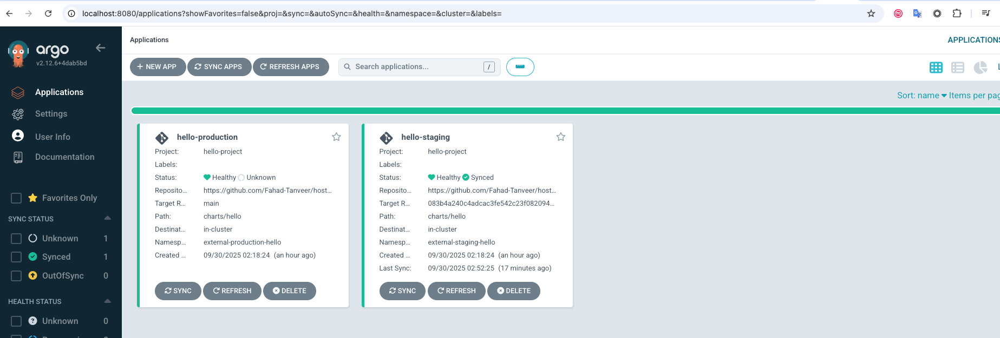
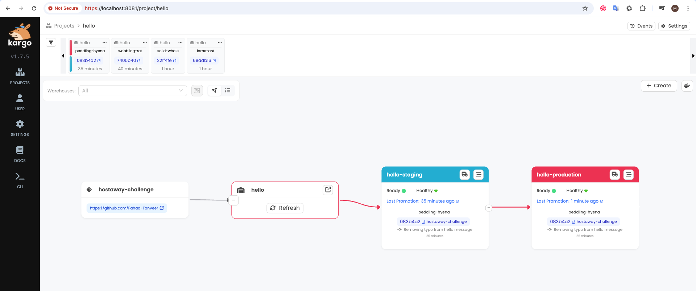

# Hostaway DevOps Engineer Task

This repository contains the solution for the **Hostaway DevOps Task**, focusing on establishing a local, GitOps-driven Kubernetes environment using **Minikube, Terraform, ArgoCD, and Kargo**.

---

## Prerequisites

Before running the setup script, ensure the following tools are installed and accessible on your system:

- [Minikube](https://minikube.sigs.k8s.io/docs/) – For running the local Kubernetes cluster  
- [kubectl](https://kubernetes.io/docs/tasks/tools/) – The Kubernetes command-line tool  
- [Terraform](https://www.terraform.io/) – For provisioning cluster components and namespaces  
- [Helm](https://helm.sh/) – The Kubernetes package manager  
- [Git](https://git-scm.com/) – For managing the application repository  

---

## 1-Command Setup and Run

To initialize the entire environment, run the following command from the root of this repository:

```bash
./setup.sh
```

## Setup Script Overview

The `./setup.sh` script triggers Terraform to provision the stack in this order:

1. **Minikube Start** – Starts the local Kubernetes cluster.  
2. **Terraform Provisioning** – Creates application namespaces and system namespaces:  
   - Application: `external-staging-hello`, `external-production-hello`  
   - System: `argocd`, `kargo`, `cert-manager`, `monitoring`  
3. **Helm Installation (cert-manager)** – Installs cert-manager into the `cert-manager` namespace.  
4. **Helm Installation (Argo CD)** – Installs Argo CD into the `argocd` namespace.  
5. **Helm Installation (Kargo)** – Installs Kargo into the `kargo` namespace.  
6. **Argo CD Project & Applications** – Creates the AppProject and the `hello-staging` and `hello-production` Applications that sync the Helm chart from Git.  


## Accessing the Tooling

### 1. ArgoCD (GitOps Synchronization)

ArgoCD is responsible for continuously synchronizing the desired state defined in Git to the cluster.

Run the command below to access the ArgoCD Web UI:

```bash
kubectl port-forward -n argocd svc/argocd-server 8080:80
```

**Access Details:**

- **Host:** [http://localhost:8080/](http://localhost:8080/)  
- **Username:** `admin`  
- **Password:** `admin`

You will see the `hello-staging` and `hello-production` applications deployed in the ArgoCD UI, which may initially be in an `Unknown` or `Degraded` state until `Kargo` promotes the first successful commit.




### 2. Kargo (Deployment Progression and Rollback)

Kargo manages the release promotion pipeline (**Staging → Production**) and provides a clear view of available commits for rollback.

Run the command below to access the Kargo Web UI:

```bash
kubectl port-forward -n kargo svc/kargo-api 8081:443
```

**Access Details:**

- **Host:** [https://localhost:80801/](https://localhost:80801/)  
- **Username:** `admin`  
- **Password:** `admin`

In the Kargo UI, click on the hello project. You will see the pipeline (similar to the image below), visualizing the flow from the source repository to the hello-staging and hello-production stages.




## GitOps Workflow: Deployment, Promotion, and Rollback

We use **Kargo** to manage the movement of releases between environments.

### 1. Deploying a New Version (Source Change)

- **Update the Application:** Modify the application source code (e.g., [change the "hello it's me" message](https://github.com/Fahad-Tanveer/hostaway-challenge/blob/main/charts/hello/values.yaml#L43)) and commit the changes to the source repository's main branch.  
- **Kargo Detection:** Kargo automatically detects the new commit SHA in the source repository.  
- **Promote to Staging:** In the Kargo UI, find the new commit at the top of the Commits list. Promote this new commit/release to the `hello-staging` stage.  
- **ArgoCD Sync:** Kargo automatically updates the target revision of the `hello-staging` ArgoCD Application to the new commit SHA. ArgoCD then synchronizes the change to the `external-staging-hello` namespace.  

### 2. Promotion to Production

- **Promote Upstream:** In the Kargo UI, select the `hello-production` stage.  
- **Promote:** Click the promotion button and select the upstream stage (`hello-staging`) as the source for the promotion.  
- **ArgoCD Sync:** Kargo updates the target revision of the `hello-production` ArgoCD Application to match the version running in Staging. ArgoCD synchronizes the successful release to the `external-production-hello` namespace.  

### 3. Rollback

- **Identify Target Version:** In the Kargo UI, view the Commits history and identify the commit SHA of the previous, stable version you wish to roll back to.  
- **Execute Rollback:**  
  1. Select the target stage (`hello-production`).  
  2. Click the promotion button, but instead of using the upstream stage, select the specific known-good Commit SHA from the list.  
- **Result:** Kargo immediately updates the ArgoCD application to point to the older SHA, initiating a rollback to the previous stable state.  

## Application Access and Metrics

The application is deployed to two separate namespaces: `external-staging-hello` and `external-production-hello`.

### Accessing the Application

Use `kubectl port-forward` to access the staging environment locally:

```bash
kubectl -n external-staging-hello port-forward svc/hello-staging 8082:80 4040:4040
```

### Application Endpoints

- **Nginx Web Server:** [http://localhost:8082](http://localhost:8082)  
- **Metrics Endpoint:** [http://localhost:4040/metrics](http://localhost:4040/metrics)  

**Success Endpoint Example:**

```bash
curl -s http://localhost:8082/success
```

**Expected Output (Example):**

```json
{
  "message": "hello its me",
  "version": "1.0.0-staging",
  "environment": "staging",
  "timestamp": "...",
  "endpoint": "/success",
  "status": "success"
}
```

**Failure Endpoint Example (Always returns 500):**

```bash
curl -i http://localhost:8082/fail
```
